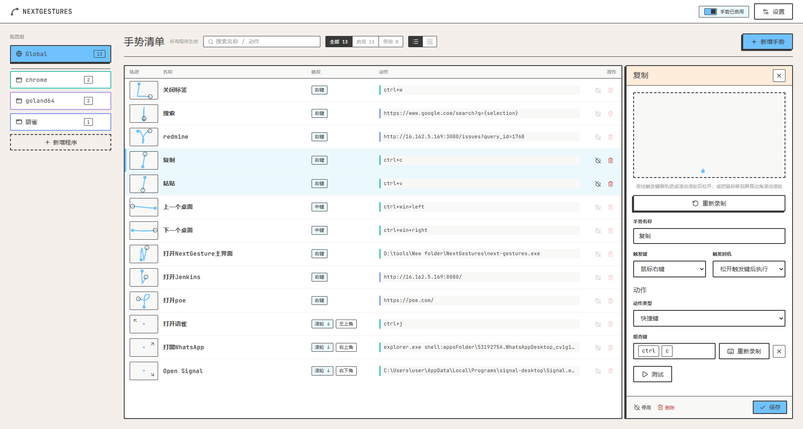

<div align="center">
  

  # NextGestures

  一款轻量、可编程的 Windows 鼠标手势工具

</div>

<div align="center">
  
</div>

## 这是什么

NextGestures 是一个运行在系统托盘中的 Windows 鼠标手势工具：按住触发键（右键 / 中键 / 侧键）在屏幕上滑出一段轨迹，即可执行对应的动作——发送快捷键、按序输入组合键、打开网址、运行命令，甚至执行一段 Lua 脚本。手势可以按「当前前台程序」分组，不同软件下同一个手势也能触发不同动作。

## 缘起

灵感主要来自 [WGesture](https://github.com/lujjjh/WGesture)，一款体验很好的 Windows 鼠标手势软件。但它在我的新电脑上运行时存在兼容性问题，且项目已经很久没有更新维护了，于是自己动手开发了这款平替版本。

## 功能特性

- **手势识别**：以右键 / 中键 / 侧键 1 / 侧键 2 作为触发键，绘制任意方向轨迹并配合滚轮组合；支持屏幕区域限定触发。
- **多种动作类型**：
  - 发送快捷键 / 连续按键序列
  - 打开网址（支持 `{selection}` 占位符，自动取剪贴板/选中文本并做 URL 编码）
  - 运行任意程序或 shell 命令
  - 执行自定义 Lua 脚本（内置 `ng.send_keys` / `ng.run` / `ng.selection` / `ng.cursor` / `ng.exe` 等 API）
- **按程序分组配置**：除全局配置组外，可为指定 `.exe` 单独创建配置组，同一手势在不同程序下互不干扰。
- **实时轨迹反馈**：绘制手势时窗口上会显示半透明轨迹叠加层（overlay），松开鼠标即刻触发。
- **冲突检测**：同一配置组内轨迹过于相似的手势会被自动标出，避免误触发。
- **单/双视图管理**：列表视图与卡片视图，支持按名称/动作搜索及启用状态筛选。
- **托盘常驻**：关闭主窗口不退出程序，可通过托盘菜单或全局热键快速启/停手势识别。
- **开机自启**：可在设置中一键开启/关闭。
- **自动更新**：启动时静默检测 GitHub 最新版本，发现新版本会弹窗提示更新日志，确认后自动下载安装并重启。

## 安装

前往 [Releases](../../releases) 下载最新的 Windows 安装包（`.exe`，基于 NSIS）并运行安装向导即可。

首次启动后，NextGestures 会常驻在系统托盘，双击或点击托盘图标即可打开设置窗口。

## 使用方法

1. **添加手势**：打开主窗口，点击右上角「新增手势」。
2. **录制轨迹**：选择触发键（右键 / 中键 / 侧键），按住并在屏幕任意位置画出想要的轨迹（可叠加滚轮方向作为组合条件）。
3. **配置动作**：为该手势选择要执行的动作类型（快捷键、按键序列、打开网址、运行命令或 Lua 脚本），填写对应参数。
4. **（可选）限定生效程序**：默认手势对所有程序生效（Global）；如果只想在某个软件里生效，先在左侧「新增程序」创建一个绑定到该 `.exe` 的配置组，再在该组下添加手势。
5. **保存并使用**：保存后回到桌面任意界面，按住对应触发键画出轨迹即可触发动作。

其他常用操作：

- 顶部开关可以一键启用 / 停用所有手势识别（也可在托盘菜单或全局热键中切换）。
- 手势列表右侧可以单独启用/停用或删除某条手势，重复/相似的轨迹会被标记「轨迹冲突」提示优化。
- 「设置」中可以调整轨迹颜色、匹配灵敏度、界面语言、开机自启等选项。

## 技术栈

- 前端：React + TypeScript + Vite
- 桌面壳层：[Tauri 2](https://tauri.app/)
- 核心逻辑：Rust（`crates/core` 手势识别引擎，`crates/platform` Windows 平台交互，`src-tauri` 应用层）

## 本地开发

```bash
npm install
npm run tauri dev    # 启动开发环境
npm run tauri build  # 打包生成安装包
```
